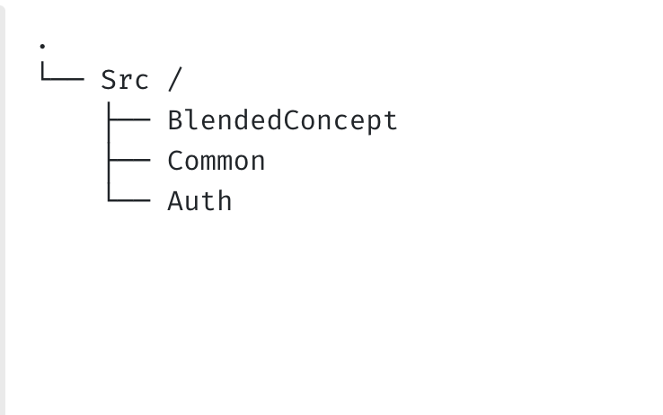

## Our DDD folder structure

  This is the root folder structure of our project that contains the `BlendedConcept` , `Common` and `Auth` as root domain.

   **BlendedConcept** contains all the module and feature that we implement we might need to write inside by create `Domain` name according to each module 

   **Auth** contains the basic `login` and `register` that we have implement inside that domain. 

   **Common** are the root folder structure setup of laravel that we have implement inside it.
  

  As a example  
  You have `RouteServiceProvider` , `AppServiceProvider` inside  `Common` folder here we might need to link their `routes` and `ServiceProvider` from other Domains to these Domain
<ul> 
</ul>

